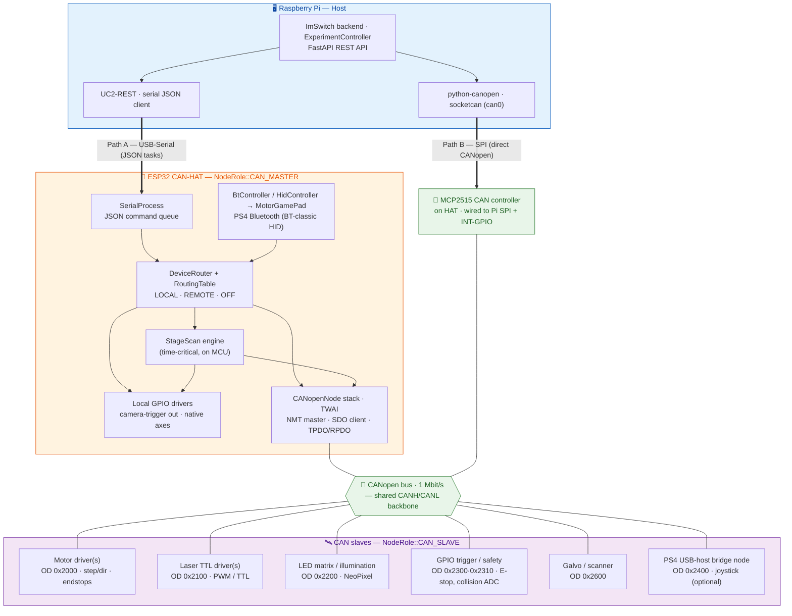
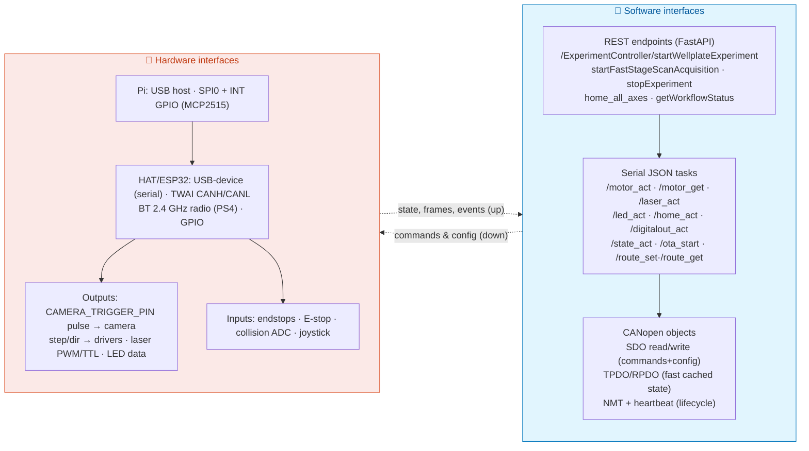
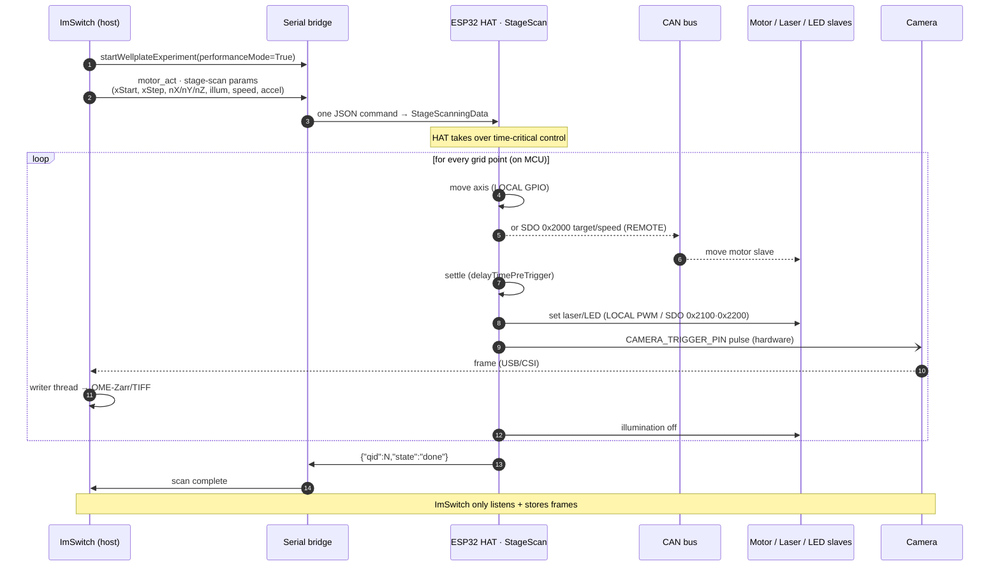
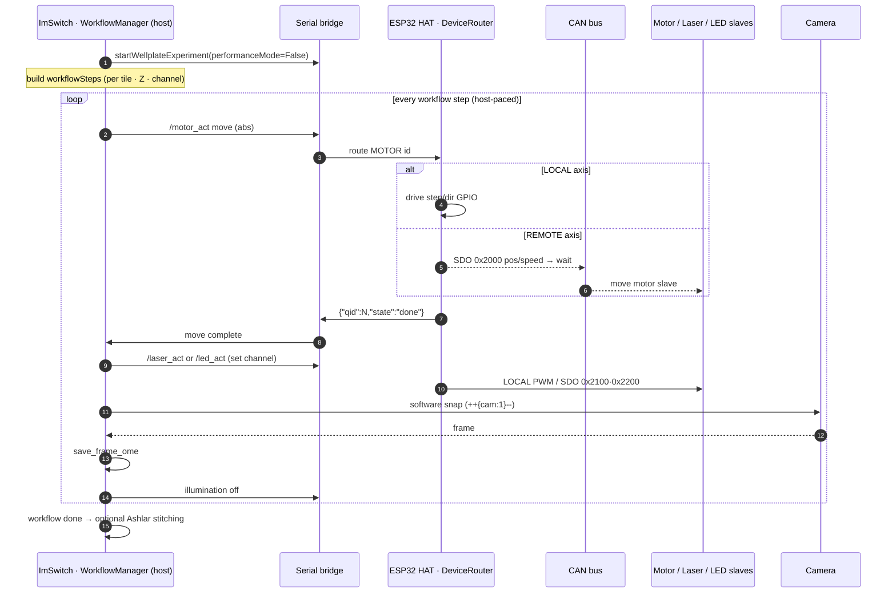

# UC2 CANopen Network Architecture

How the Raspberry Pi (running **ImSwitch**) drives the UC2 microscope over a
shared **CANopen** bus, the two physical ways the Pi reaches that bus, and the
two control regimes — **StageScan / performance mode** (the HAT owns
time-critical timing) and **sequential / normal mode** (ImSwitch owns per-frame
timing).

Source of truth for the labels below:

- Firmware: `main/src/canopen/` (`DeviceRouter`, `RoutingTable`, `CANopenModule`),
  `main/src/motor/StageScan.cpp`, `main/src/bt/` (PS4), `main/src/gpio_can/`,
  `main/src/config/RuntimeConfig.h`, `main/src/canopen/UC2_OD_Indices.h`.
- Host: ImSwitch `ExperimentController.py` + `experiment_controller/experiment_performance_mode.py`,
  `positioners/ESP32StageManager.py`.

---

## 1. System topology — two ways onto one CAN bus

Everything ultimately talks on **one shared CANopen bus**. The Pi can reach it
**(A) indirectly** through the ESP32 CAN-HAT acting as a serial→CAN gateway, or
**(B) directly** through an **MCP2515** controller on the HAT wired to the Pi's
own SPI/GPIO. Both the ESP32 (via its native TWAI controller) and the MCP2515
sit on the *same* CANH/CANL as every slave.

**Path A — serial gateway (default).** The HAT is the CANopen master.
`UC2-REST` sends JSON tasks (`/motor_act`, `/laser_act`, …) over USB-serial;
`DeviceRouter` decides per logical device whether to run it on the HAT's own
GPIO (`LOCAL`) or forward it to a slave as a CANopen **SDO** (`REMOTE`).

**Path B — direct MCP2515 (Pi is CANopen master).** The Pi drives `can0`
through the MCP2515 with `python-canopen`, issuing SDO/PDO/NMT itself. The
ESP32's serial bridge is bypassed for device I/O; the HAT can still be powered
for PS4 Bluetooth and local-only jobs. Off-the-shelf CANopen tooling
(`python-canopen`, analyzers) decodes the same traffic.

---

## 2. Input / output interfaces — hardware & software

| Direction | Software (host ↔ firmware) | Hardware |
|---|---|---|
| **Host → device (commands)** | REST call → JSON task over serial → SDO write to OD index | USB-serial bytes; SPI frames to MCP2515; CAN frames on bus |
| **Device → host (state)** | TPDO/heartbeat → `RemoteSlaveState` cache → `/motor_get`, async notifications | CAN frames; endstop/E-stop levels; collision ADC |
| **Trigger / acquisition** | hardware trigger (fast path) **or** software `++{"cam":1}--` over serial | `CAMERA_TRIGGER_PIN` GPIO pulse → camera; camera USB/CSI → ImSwitch |
| **Manual control** | — | PS4 → BT-HID → `MotorGamePad`; or PS4 → USB-host bridge → CAN joystick node |

---

## 3. StageScan / performance mode — the HAT owns timing

`performanceMode=True` and hardware triggering. ImSwitch sends the scan
**parameters once**; the ESP32 `StageScan` engine then runs the whole grid on
the MCU — moving motors, settling, switching illumination, and pulsing the
camera trigger with deterministic timing. ImSwitch only listens to the camera
and writes frames (OME-Zarr/TIFF). Per-frame LED-matrix patterns (DPC) cannot
ride this fast path and force a fallback to mode §4.

---

## 4. Sequential / normal mode — ImSwitch owns timing

`performanceMode=False`. The `WorkflowManager` walks the tile/Z/channel list
**one step at a time over serial** (software trigger). The host commands each
move, sets illumination, snaps and saves a frame, then turns illumination off —
full per-frame control, at the cost of serial round-trip latency. Each device
command is still routed `LOCAL` or `REMOTE` by `DeviceRouter` on the HAT.

---

## 5. Command & data-flow reference

**Routing (`DeviceRouter` + `RoutingTable`).** One row per logical device
(`MOTOR`, `LASER`, `LED`, `GALVO`, `HOME`, `TMC`, `DAC`, `AIN`, `DIN`) →
`LOCAL` (HAT GPIO), `REMOTE` (CAN node + sub-axis), or `OFF`. Built at boot from
`pinConfig` + `runtimeConfig.canRole`; editable live via `/route_set`.

**Two CAN transport classes:**
- **SDO** — addressed, acknowledged read/write of an OD index → commands & config
  (target position, laser PWM, homing, OTA, reboot).
- **TPDO/RPDO + heartbeat** — periodic, broadcast → fast state (actual position,
  status word, E-stop, collision ADC) cached on the master in `RemoteSlaveState`
  so `/motor_get` needs zero bus round-trips.

**PS4 paths (both supported):**
- **Bluetooth** → BT-HID on the HAT → `MotorGamePad` → `DeviceRouter` (axes go
  LOCAL or REMOTE just like any motor command).
- **USB-host bridge** (optional XIAO-S3 node) → publishes joystick onto CAN
  (OD 0x2400) → master's `JoystickController` consumes it identically.

**Object-dictionary base indices** (`UC2_OD_Indices.h`):

| Base | Device | Key sub-objects |
|---|---|---|
| `0x2000` | Motor | target/actual pos, speed, command/status word, enable, accel, min/max |
| `0x2010` | Homing | command, speed, direction, endstop polarity/release |
| `0x2020` | TMC | microsteps, RMS current, StallGuard, CoolStep |
| `0x2030` | Hard-limit | command, enabled, polarity |
| `0x2100` | Laser | PWM value, max, frequency, despeckle, safety state |
| `0x2200` | LED array | mode, brightness, colour, pixel count, layout |
| `0x2300` | Digital I/O | input state, **output command**, change mask (E-stop, triggers) |
| `0x2310` | Analog I/O | analog input, filtered, DAC out (collision ADC) |
| `0x2400` | Joystick | axis, buttons, speed multiplier, deadzone |
| `0x2500` | System | firmware version, board name, uptime, **reboot** |
| `0x2600` | Galvo | target/actual pos, scan speed, steps/line, X/Y start |

**Mode selection at a glance:**

| | StageScan / performance (§3) | Sequential / normal (§4) |
|---|---|---|
| Owns timing | ESP32 HAT (on MCU) | ImSwitch host |
| Trigger | hardware (`CAMERA_TRIGGER_PIN`) | software (`++{cam:1}--`) |
| Serial traffic | params once, then quiet | one round-trip per step |
| Host role | listen to camera + store | command every move/snap |
| Use when | fast XY raster, simple illumination | DPC/LED-matrix patterns, per-frame logic |
