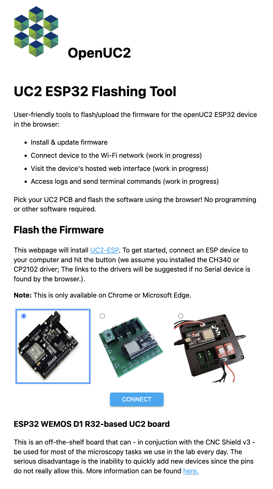

# UC2-ESP Firmware for the openUC2 UC2e electronics

This repository provides the latest (`V2`) firmware that controls external hardware like Motors, LEDs, Lasers and other customized elements using an ESP32 and an adapter board. It is inspired by the [UC2-REST](https://github.com/openUC2/UC2-REST/tree/master/ESP32) firmware, but features a much more structured way of the code by dividing modules into seperated classes. A `ModuleController` ensures a proper initializiation of individual modules at runtime, which makes the entire code very modular and follows the overall UC2 principle.

Similar to the legacy UC2-REST Firmware, the microcontroller can communicate using the wired serial and the wireless WiFi protocol. Both rely on a more-less similar `REST API` that uses endpoints to address an `act, get, set` command. For example, the information about the state of the ESP can be retrieved by issuing the code:

```
{"task":"/state_get"}
```

A list of all commands that can be sent via HTTP requests and serial commands (e.g. by using the Arduino IDE-contained Serial monitor at 115200 BAUD) can be found in the [RestApi.md](./RestApi.md)-file.

# Setting up the build environment

In order to build the code, you have to follow the following steps:

1. Install Visual Studio Code + the Extension called "Platform.io" => Restart Visual studio code to load PIO
2. Clone this repository including all the submodules: `git clone --recurse-submodules https://github.com/youseetoo/uc2-esp32`
3. Open the main folder in the Visual Studio Code
4. Adjust the settings in the file `platformio.ini`-file (mostly the port)
4.1. Go to Platformio Home and navigate to Devices
4.2 Copy the Device port (if connected) and insert that into the `platformio.ini`, e.g. `upload_port = /dev/cu.SLAB_USBtoUART` or `COM3`for windoof
5. Hit the `PlatformIO upload` button; The following task will be run: `platformio run --target upload`; The code is getting compiled and saved into `./.pio/build/`
5.1 The code will be uploaded. If eerything goes right the terminal says: `Leaving... Hard resetting via RTS pin...``
6. open the PlatformIO serial monitor (remember to also change the port in the `platform.io` accordingly) and check the ESP32's output (eventually hit the reset button)
7. In case you have any problems: File an issue :-)


  In order to test several commands, you can find a useful list of `json`files in this file: [main/json_api_BD.txt](main/json_api_BD.txt)
# Flash the firmware using the Web-Tool

A new way to flash the firmware to the ESP32 is to use the open-source ESPHome Webtool. We have modified it such that the software in thi repo is compiled and uploaded to the website:

**[www.youseetoo.github.io]**(youseetoo.github.io)

There you can select the board you have and flash the code. If the driver is properly installed, you simply select the port and hit `start`. The firmware will automatically be downloaded and flashed through the browser.

<p align="center">

<br> This shows the gui to first select the board you have before the browser (chrome/edge) automatically flashes the firmware.
</p>

# Additional information

This is a fastly moving repo and the information may get outdated quickly. Please also check the relevant information in our [documentation](https://openuc2.github.io/docs/Electronics/uc2e1)


# Information about the REST commands

Every component can be used by calling it in a REST-ful way. A not-complete document that describes the most important functions can be found [here](./RestApi.md)

The general structure for the serial would become:

````
{"task": "/state_get"}
````

to get the information about the MCU. A additional cheat-sheet can be found [here](main/json_api_BD.txt)

# Implement your own module

The object oriented structure of the Firmware allows one to (more-less) easily implement additional components/modules. A rough structure where to add the different components like endpoints, REST-hooks, etc. is summarized [here](DOC_Firmware.md).

# Some Arduino-CLI/ESPTOOL/PlatformIO-related commands

This is a random collection of tasks/commands that are useful to compile/upload the code by hand.


Convert the firmware into a single file:

```
cd uc2-ESP/.pio/build/esp32dev
python -m esptool --chip esp32 merge_bin  -o merged-firmware.bin  --flash_mode dio  --flash_freq 40m  --flash_size 4MB  0x1000 bootloader.bin  0x8000 partitions.bin  0xe000 boot_app0.bin  0x10000 firmware.bin
```

Install the ESP32 core

```
arduino-cli core update-index --config-file arduino-cli.yaml
arduino-cli core install esp32:esp32
arduino-cli board list
```

Compile the firmware in a dedicated output folder

```
mkdir build
arduino-cli compile --fqbn esp32:esp32:esp32:PSRAM=disabled,PartitionScheme=huge_app,CPUFreq=80 ESP32/main/main.ino  --output-dir ./build/ --libraries ./libraries/
```

Flash the firmware to the ESP32 board

```
esptool.py --chip esp32 --port /dev/cu.SLAB_USBtoUART --baud 921600 --before default_reset --after hard_reset write_flash -z --flash_mode dio --flash_freq 80m --flash_size 4MB 0x1000 /build/main.ino.bootloader.bin 0x8000 /build/main.ino.partitions.bin 0xe000 /build/boot_app0.bin 0x10000 /build/main.ino.bin
```

Upload the firmware using the Arduino-CLI

```
arduino-cli upload -p /dev/cu.usbserial-1310 --fqbn esp32:esp32:esp32-poe-iso .
```


Screen the serial monitor

```
screen /dev/cu.usbserial-1310 115200
```

Upload via esptool:

```
pip install esptool
python -m esptool --chip esp32 --port /dev/cu.SLAB_USBtoUART --baud 921600  write_flash --flash_mode dio --flash_size detect 0x0 main.ino.bin
```
